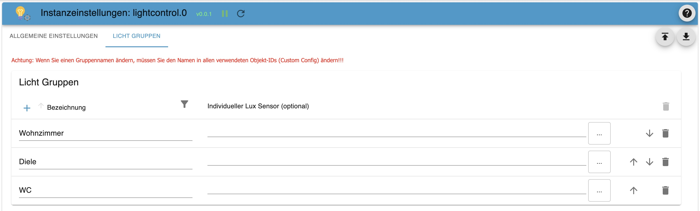
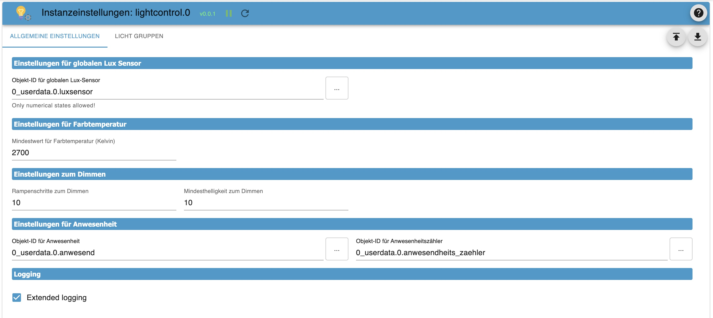
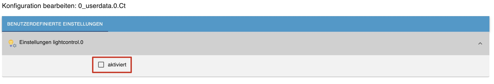
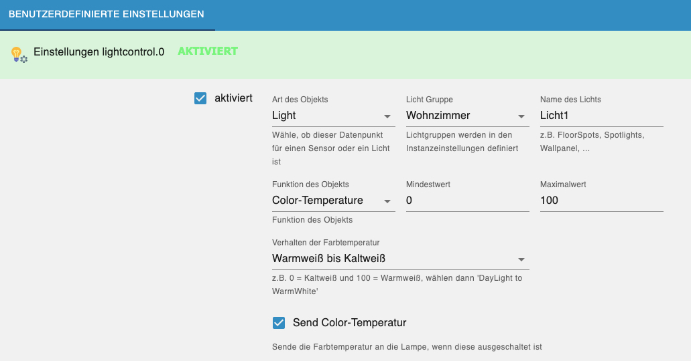
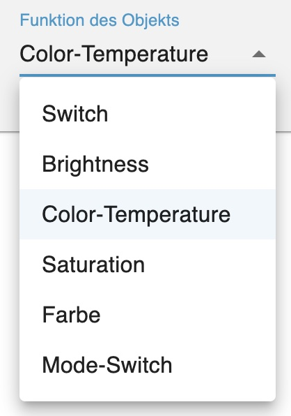

# LightControl

### _Steuerung von Lampen unterschiedlicher Hersteller_

---

# Inhaltsverzeichnis

-   [1 Features](#1-features)
-   [2 Installation](#2-installation)
-   [3 Konfiguration](#3-konfiguration)
-   [4 Gruppeneinstellungen - Startseite](#4-gruppeneinstellungen)
    -   [4.1 Lichtgruppen](#41-lichtgruppen)
    -   [4.2 Allgemeine Einstellungen](#42-allgemeine-einstellungen)
-   [5 Lichter und Sensoren](#5-lichter-und-sensoren)
    -   [5.1 Lichter](#51-lichter)
    -   [5.2 Sensoren](#52-sensoren)
-   [6 Datenpunkte](#7-datenpunkte)
    -   [6.1 Datenpunkte für alle Gruppen](#61-datenpunkte-für-alle-gruppen)
    -   [6.2 Datenpunkte der einzelnen Gruppe](#62-datenpunkte-der-einzelnen-gruppe)
-   [7 Was ist für die Zukunft geplant](#6-was-ist-fr-die-zukunft-geplant)
-   [8 Was ist nicht geplant](#8-was-ist-nicht-geplant)

---

# 1. Features

-   Gruppierung beliebig vieler Lampen/Leuchtmittel
-   Verwendung gemischter Lampen/Farbsystemen und Umrechnung der Farbsysteme (Hex,Rgb,Xy)
-   Möglichkeit der Zuweisung von defaultwerten zu jedem Leuchtmittel (gleiche Helligkeit trotz unterschiedlich leistungsstarker Leuchtmittel)
-   Verwendung beliebig vieler Bewegungsmelder pro Gruppe
-   Ramping (langsame Änderung der Helligkeit bis Zielwert) für on und off
-   Hoch- und Runterdimmen
-   AutoOff nach Zeit / Kein Off bei Bewegung;
-   AutoOff nach Helligkeit
-   AutoOn bei Bewegung ab bestimmter Helligkeit
-   AutoOn bei Dunkelheit
-   AutoOn bei Anwesenheitszählererhöhung ab bestimmter Helligkeit (Begrüßungslicht bei heimkommen)
-   Override on (Putzlicht)
-   Masterswitch um alle Gruppen gemeinsam ein- und auszuschalten (Gleichzeitig Indikator, wenn alle Gruppen an sind)
-   Info Datenpunkt für "beliebige Gruppe ist ein"
-   Blinken (Alarm, Türklingel, etc.)
-   Adaptive Helligkeit (Bei Aussenhelligkeit über 1000 Lux volle Helligkeit (100%), darunter linear dunkler bis 0 Lux (2%))
-   Adaptive Farbtemperatur (4 dynamische Modi: Linear (linear ansteigend von Sonnenaufgang bis Sonnenmittag, dann linear abfallend bis Sonnenuntergang), Solar (entsprechend der Sonnenhöhe errechneter Sinus, maxCt ist Jahreszeitenabhängig), SolarInterpoliert (wie Solar, jedoch ohne Jahreszeitenabhängigkeit), StartYourDay (linear Absteigend von Start-Uhrzeit - Sonnenuntergang) 

---

-   [zurück zum Inhaltsverzeichnis](#inhaltsverzeichnis)

---

# 2. Installation

Der Adapter befindet sich in der Beta-Repository des ioBrokers.
Nach dem Download kann man durch anklicken des (+) eine Instanz angelgen.

---

-   [zurück zum Inhaltsverzeichnis](#inhaltsverzeichnis)

---

# 3. Konfiguration

Sollte in dem Installationsfenster die Checkbox "**_schließen, wenn fertig_**" nicht angehakt sein muss man dieses natürlich noch schließen.

Das Konfigurationsfenster besteht aus den Reitern:

-   [4. Gruppeneinstellungen](#4-gruppen-einstellungen)
-   [5. Lichter und Sensoren](#5-lichter-und-sensoren)

---

-   [zurück zum Inhaltsverzeichnis](#inhaltsverzeichnis)

---

# 4. Gruppeneinstellungen

Das Konfigurationsfenster öffnet sich automatisch mit den Gruppeneinstellungen. Hier werden die einzelnen Lichtgruppen erstellt.

## 4.1 Lichtgruppen

Mit Klick auf das + wird eine neue Zeile erstellt.

-   Bezeichnung: Hier benennt man die Gruppe. Achtung: Keine doppelten Namen anlegen!!
-   Individueller Lux Sensor: Hier definiert man einen individuellen Lux-Sensor. Über die 3 Punkte an der rechten Seite lässt sich eine Objekt-ID einfügen. Wenn das Feld leer gelassen wir, so wird für die Lichtgruppe der globale Lux-Sensor verwendet, sofern einer definiert ist.

## 4.2 Allgemeine Einstellungen

-   **Einstellungen für globalen Lux-Sensor**
    -   Dieser Sensor wird global verwendet, sofern nicht innerhalb einer Gruppe ein individueller Sensor gewählt wurde
    -   Es muss ein numerischer Datenpunkt gewählt werden!
-   **Einstellungen für die Farbtemperatur**
    -   Minimalwert für die Farbtemperatur in Kelvin => Standard: 2700
    -   Maximalwert für die Farbtemperatur in Kelvin => Standard: 6500
-   **Einstellungen zum Dimmen**
    -   Rampenschritte zum Dimmen => Standard: 10
    -   Mindeshelligkeit beim Dimmen über den Datenpunkt _DimmDown_ => Standard: 10
-   **Einstellungen für Anwesenheit**
    -   Objekt-ID der Anwesenheit => Muss _true_ oder _false_ sein
    -   Objekt-ID des Anwesenheitszählers => Muss eine Nummer sein.
-   **Logging**
    -   Erweitertes User-Logging

---

-   [zurück zum Inhaltsverzeichnis](#inhaltsverzeichnis)

---

# 5 Lichter und Sensoren

Alle Lichter und Sensoren werden über die jeweiligen Datenpunkte den Lichtgruppen hinzugefügt:

Nach Öffnen der Einstellungen muss die Konfiguration aktiviert werden:

## 5.1 Lichter

-   **Typ des Objekt**
    In vielen Fällen erkennt LightControl, ob es sich um ein Licht oder Sensor handelt. Wenn dies nicht der Fall sein sollte, ist _Licht_ voreingestellt.

-   **Licht Gruppe**
    Hier wählt man die zuvor in den Instanzeinstellungen definierten Lichtgruppen aus (Mehrfachauswahl möglich -> Bug)

-   **Lichtname**
    Hier einen Namen für das Licht definieren. Schon zuvor definierte Namen werden zur Auswahl vorgeschlagen

-   **Funktion des Objekts**
    In vielen Fällen erkennt LightControl, um welche Funktion es sich handeln könnte. Wenn die automatische Erkennung nicht dem entspricht, was gewünscht ist, dann über das DropDown Menü die jeweilige Funktion auswählen

    

    -   **Switch**

        -   Power On Value - _Wert für Ein. z.B. true_
        -   Power Off Value - _Wert für Aus. z.B. false_

    -   **Brightness**

        -   Value for minimum Brightness - _Wert die geringste Helligkeit. z.B. 0_
        -   Value for maximum Brightnes - _Wert für die maximalste Helligkeit. z.B. 100_
        -   Value/Offset for Brightness - _Korrekturwert/Max-Wert für die Anpassung der Helligkeit gegenüber den anderen Lampen innerhalb der Gruppe._
        -   Use Brightness for Switching - _Verwendet den Helligkeits Datenpunkt der Lampe, um diese zu schalten, anstatt den Power Datenpunkt_

    -   **Color-Temperature**

        -   Value for minimum Color-Temperature - _Wert Warmweiß. z.B. 250_
        -   Value for maximum Color-Temperature - _Wert für Kaltweiß. z.B. 452_
        -   Verhalten der Farbtemperatur - _Festlegen des Verlaufs der Farbtemperatur (Warm- zu Kaltweiß oder Kalt- zu Warmweiß)_
        -   Send Color-Temperatur - _Sende die Farbtemperatur an die Lampe, auch wenn diese ausgeschaltet ist_

    -   **Saturation**

        -   Value for minimum Saturation - _Wert für die geringste Sättigung. z.B. 0_
        -   Value for maximum Saturation - _Wert für die maximale Sättigung. z.B. 100_
        -   Send Saturation - _Sende die Sättigung an die Lampe, auch wenn diese ausgeschaltet ist_

    -   **ModeSwitch**

        -   Value for White Mode - _Wert für den Weiß-Modus. z.B. false_
        -   Value for Color Mode - _Wert für den Farbmodus. z.B. true_
        -   Send ModeSwitch - _Ändere den Modus der Lampe, auch wenn diese ausgeschaltet ist_

    -   **Color**
        -   Color Type - _Typ der Farbvorgabe (HEX => #FFFFFF // RGB => 255,255,255 // XY => [0.4992,0.418])_
        -   Default Value for Color- _Standardwert. z.B. #FFFFFF_
        -   Send Color - _Sende die Farbe an die Lampe, auch wenn diese ausgeschaltet ist_

-   [zurück zum Inhaltsverzeichnis](#inhaltsverzeichnis)

---

## 5.2 Sensoren

### 4.2.1 Allgemeines

-   Wenn ein Sensor auslöst, wird das Licht geschalten (sofern in den Datenpunkten aktiviert).
-   Erst wenn ALLE Sensoren nichts mehr registrieren, wird der Ausschaltprozess gestartet (sofern in den Datenpunkten aktiviert).

> Hinweis: Theoretisch können hier auch Schalter angegeben werden. Hauptsache es gibt für Ein/Aus unterschiedliche Werte. Jedoch verhält sich der Auschaltprozess je nach Einstellung. z.B. Licht geht aus nach 60 Sekunden

-   Value for Motion - _Wert für Bewegung erkannt. z.B. true_
-   Value for noMotion - _Wert für keine Bewegung. z.B. false_

---

-   [zurück zum Inhaltsverzeichnis](#inhaltsverzeichnis)

# 6 Datenpunkte

## 6.1 Datenpunkte für alle Gruppen

-   **All**
    -   **power:** Alle Gruppen ein-/ausschalten / Indikator, wenn alle Gruppen an sind
    -   **anyOn:** _true_ wenn mindestens eine Gruppe an ist

## 6.2 Datenpunkte der einzelnen Gruppe

-   **Gruppe**

    -   **autoOffLux:** AutoOff des Lichts bei erreichen einer Helligkeitsschwelle

        -   **enabled:** AutoOff bei Helligkeit aktivieren/deaktivieren
        -   **minLux:** minimaler Lichtwert
        -   **dailyLock:** Bei false wird AutoOffTimed nicht ausgeführt
        -   **operator:** Vergleich ob Licht über oder unter _minLux_ ausgehen soll (z.B. > / < / >= / <=)

    -   **autoOffTimed:** AutoOff nach fest eingestellter Zeit (Nur in Verbindung mit den Sensoren)

        -   **enabled:** AutoOff aktivieren/deaktivieren
        -   **autoOffTime:** Zeit bis AutoOff in Sekunden
        -   **noAutoOffWhenMotion:** AutoOff resetten bei erneuter Bewegung
        -   **noticeEnabled:** Hinweis für AutoOff aktivieren/deaktivieren (Aktuell noch ohne Funktion)
        -   **noticeBri:** Helligkeit in Prozent bevor AutoOff
        -   **noticeTime:** Zeit in Sekunden wann der Hinweis aktiviert wird bevor AutoOff

    -   **autoOnLux:** Automatisch Licht ein bei Lux

        -   **enabled:** Aktivieren/Deaktivieren
        -   **minLux:** Lux-Schwellwert für das Schalten
        -   **bri:** Helligkeit, mit der das Licht an geht
        -   **color:** Farbe, mit das Licht an geht
        -   **switchOnlyWhenPresence:** Nur Schalten, wenn jemand zuhause ist
        -   **switchOnlyWhenNoPresence:** Nur schalten, wenn niemand zu hause ist
        -   **dailyLock:** Bei false wird AutoOnLux nicht ausgeführt
        -   **operator:** Vergleich ob Licht über oder unter _minLux_ angehen soll (z.B. > / < / >= / <=)

    -   **autoOnMotion:** Automatisch Licht ein bei Bewegung

        -   **enabled:** Aktivieren/Deaktivieren
        -   **minLux:** Lux-Schwellwert für das Schalten
        -   **bri:** Helligkeit, mit der das Licht an geht
        -   **color:** Farbe, mit das Licht an geht

    -   **autoOnPresenceIncrease:** Automatisch Licht ein, wenn sich der Wert des Anwesenheitszähler größe als der letztere war

        -   **enabled:** Aktivieren/Deaktivieren
        -   **minLux:** Lux-Schwellwert für das Schalten
        -   **bri:** Helligkeit, mit der das Licht an geht
        -   **color:** Farbe, mit das Licht an geht

    -   **blink:** Blinken

        -   **enabled:** Startet Blinken in Endlosschleife, => false beendet Blinken
        -   **start:** Startet Blinken bis Anzahl erreicht.
        -   **frequency:** Blinkfrequenz in Sekunden
        -   **blinks:** Anzahl der Blinker
        -   **bri:** Helligkeit der Lampen beim Blinken
        -   **color:** Farbe der Lampen beim Blinken

    -   **rampOff:** Runterdimmen beim Ausschalten

        -   **enabled:** Aktivieren/Deaktivieren
        -   **time:** Zeit für das Runterdimmen (sollte nicht kleiner als 10 Sekunden sein)
        -   **switchOutletsLast:** Lampen welche nur ein-/ausgeschaltet werden zuletzt aktivieren?

    -   **rampOn:** Hochdimmen beim Einschalten

        -   **enabled:** Aktivieren/Deaktivieren
        -   **time:** Zeit für das Hochdimmen (sollte nicht kleiner als 10 Sekunden sein)
        -   **switchOutletsLast:** Lampen welche nur ein-/ausgeschaltet werden zuletzt aktivieren?

    -   **adaptiveBri:** Adaptive Helligkeit ein-/ausschalten
    -   **adaptiveCt:** Adaptive Farbtemperatur ein-/ausschalten
    -   **adaptiveCtMode:** Modus der adaptiven Farbtemperatur
        -   **Linear** (Sonnenaufgang --> Mittag --> Sonnenuntergang)
        -   **Solar** (entsprechend der Sonnenhöhe errechneter Sinus, maxCt ist Jahreszeitenabhängig)
        -   **SolarInterpoliert** (wie Solar, jedoch ohne Jahreszeitenabhängigkeit)
        -   **StartYourDay** (linear Absteigend von Start-Uhrzeit - Sonnenuntergang)
    -   **adaptiveCtTime:** Startzeit Adaptive Farbtemperature bei Modus: StartYourDay
    -   **bri:** Helligkeit setzen (0-100%)
    -   **color:** Farbe setzen als Hex-Wert (#FFFFFF)
    -   **ct:** Farbtemeratur setzen in Kelvin
    -   **dimmAmount:** Schritte zum Dimmen in %
    -   **dimmDown:** Button Runterdimmen
    -   **dimmUp:** Button Hochdimmen
    -   **isMotion:** Aktivieren/Deaktivieren der Sensoren
    -   **power:** Ein-/Ausschalten
    -   **powerCleaningLight:** Putzlicht (setzt Helligkeit auf 100% und Farbtemperatur auf Kaltweiß)

---

-   [zurück zum Inhaltsverzeichnis](#inhaltsverzeichnis)

---

# 7 Was ist für die Zukunft geplant

-   [ ] CodeCleaning.... ;-)
-   [ ] Hinweisfunktion bei AutoOff mit reduzierter Helligkeit
-   [ ] Intergration von einfachen Button-Events (Ein/Aus/Dimmen) für jede Gruppe

---

-   [zurück zum Inhaltsverzeichnis](#inhaltsverzeichnis)

---

# 8 Was ist nicht geplant

-   [x] Zeitpläne für das Aktivieren oder Deaktivieren von Funktionen oder zum setzten von verschiedenen Helligkeiten, etc.
