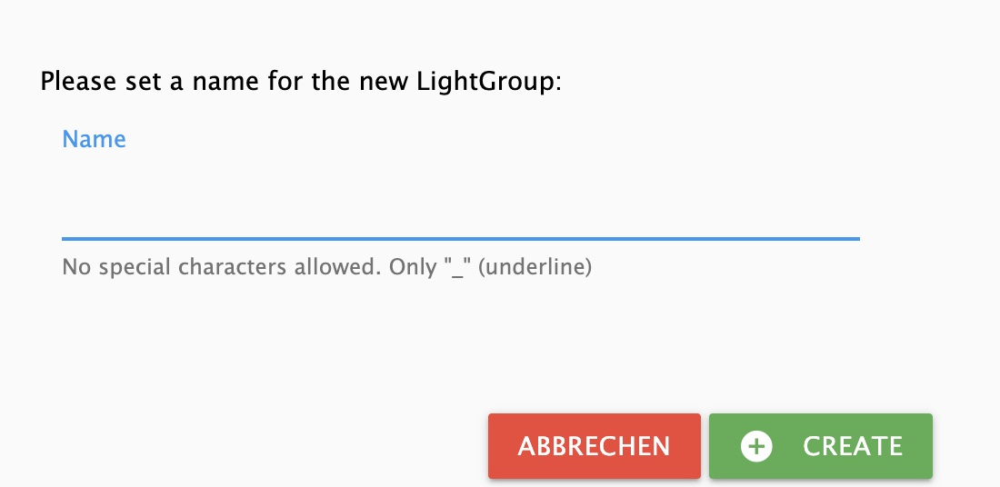
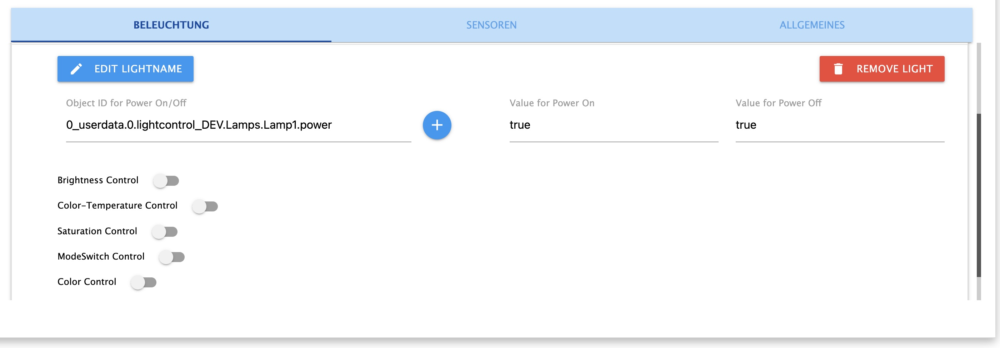
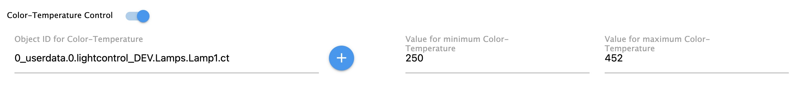
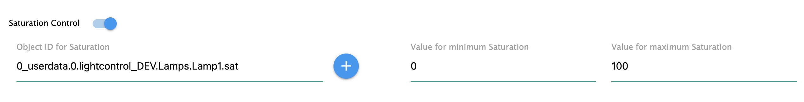
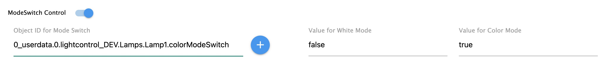
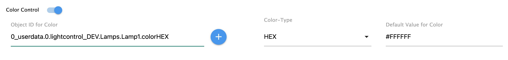
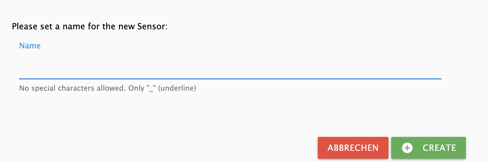

# LightControl
### *Steuerung von Lampen unterschiedlicher Hersteller* 

---

# Inhaltsverzeichnis 
* [1 Features](#1-features)
* [2 Installation](#2-installation)
* [3 Konfiguration](#3-konfiguration)
* [4 Gruppeneinstellungen - Startseite](#4-gruppeneinstellungen) 
  * [4.1 Beleuchtung](#41-beleuchtung)
    * [4.1.1 Allgemeines](#411-allgemeines)
    * [4.1.2 Objekt IDs und Werte](#412-objektidundwerte)
  * [4.2 Sensoren](#42-sensoren)
    * [4.2.1 Allgemeines](#421-allgemeines)
    * [4.2.2 Objekt IDs und Werte](#422-objektidundwerte)
  * [4.3 Allgemeines](#43-allgemeines)
* [5 Allgemeine Einstellungen](#5-allgemeine-einstellungen)
* [7 Datenpunkte](#7-datenpunkte)
* [6 Was ist für die Zukunft geplant](#6-was-ist-fr-die-zukunft-geplant) 

---

# 1. Features

* Gruppierung beliebig vieler Lampen/Leuchtmittel
* Verwendung gemischter Lampen/Farbsystemen und Umrechnung der Farbsysteme (Hex,Rgb,Xy)
* Möglichkeit der Zuweisung von defaultwerten zu jedem Leuchtmittel (gleiche Helligkeit trotz unterschiedlich leistungsstarker Leuchtmittel)
* Verwendung beliebig vieler Bewegungsmelder pro Gruppe
* Ramping (langsame Änderung der Helligkeit bis Zielwert) für on und off
* Hoch- und Runterdimmen
* AutoOff nach Zeit / Kein Off bei Bewegung; 
* AutoOff nach Helligkeit
* AutoOn bei Bewegung ab bestimmter Helligkeit 
* AutoOn bei Dunkelheit
* AutoOn bei Anwesenheitszählererhöhung ab bestimmter Helligkeit (Begrüßungslicht bei heimkommen)
* Override on (Putzlicht)
* Masterswitch um alle Gruppen gemeinsam ein- und auszuschalten (Gleichzeitig Indikator, wenn alle Gruppen an sind)
* Info Datenpunkt für "beliebige Gruppe ist ein"
* Blinken (Alarm, Türklingel, etc.)
* Adaptive Helligkeit (Bei Aussenhelligkeit über 1000 Lux volle Helligkeit (100%), darunter linear dunkler bis 0 Lux (2%))
* Adaptive Farbtemperatur (4 dynamische Modi: Linear (linear ansteigend von Sonnenaufgang bis Sonnenmittag, dann linear abfallend bis Sonnenuntergang), Solar (entsprechend der Sonnenhöhe errechneter Sinus, maxCt ist Jahreszeitenabhängig), SolarInterpoliert (wie Solar, jedoch ohne Jahreszeitenabhängigkeit), StartYourDay (linear Absteigend von Start-Uhrzeit - Sonnenuntergang)   

---
* [zurück zum Inhaltsverzeichnis](#inhaltsverzeichnis)

---

# 2. Installation

Der Adapter befindet sich in der Testphase und ist noch nicht bei ioBroker released. 
Um ihn installieren zu können muss man zu den Adapter von ioBroker gehen und über die "Katze" (Experteneinstellung) "Benutzerdefiniert" anklicken. 
Dann den Github-Link: [https://github.com/Schmakus/ioBroker.lightcontrol.git](https://github.com/Schmakus/ioBroker.lightcontrol.git) einfügen.

Nach dem Download kann man durch anklicken des (+) eine Instanz angelgen.

---
* [zurück zum Inhaltsverzeichnis](#inhaltsverzeichnis)

---

# 3. Konfiguration

Sollte in dem Installationsfenster die Checkbox "***schließen, wenn fertig***" nicht angehakt sein muss man dieses natürlich noch schließen.

Das Konfigurationsfenster besteht aus den Reitern:
* [4. Gruppeneinstellungen](#4-gruppen-einstellungen)
* [5. Allgemeine Einstellungen](#5-allgemeine-einstellungen)

---
* [zurück zum Inhaltsverzeichnis](#inhaltsverzeichnis)

---

# 4. Gruppeneinstellungen

Das Konfigurationsfenster öffnet sich automatisch mit den Gruppeneinstellungen. Hier werden die einzelnen Lichtgruppen erstellt.

Mit Klick auf das + wird eine neue Gruppe erstellt. Erlaubtes Sonderzeichnen ist ausschließlich "_". 

Um eine Gruppe zu bearbeiten, klickt man auf den Gruppennamen. Es öffnet sich ein weiteres Menü.
Hier lassen sich die jeweiligen Lampen und Sensoren konfigurieren.

**Mit "EDIT GROUPNAME" lässt sicher Gruppenname ändern.**
**Mit "REMOVE GROUP" kann die Gruppe gelöscht werden.**

* [4.1 Beleuchtung](#41-beleuchtung)
* [4.2 Sensoren](#42-sensoren)
* [4.3 Allgemeines](#43-allgemeines)

---

* [zurück zum Inhaltsverzeichnis](#inhaltsverzeichnis)

---

## 4.1 Beleuchtung

### 4.1.1 Allgemeines

Info: Eine Objekt-ID lässt sich durch Klick auf das + neben dem Eingabefeld auswählen oder kann direkt eingegeben werden.
Dabei bitte die Datenpunkte mit STATE (o. ä.) auswählen. NICHT das Gerät als solches.

### 4.1.2 Objekt-IDs und Werte

* **Power On/Off => Plichtfeld**
    * Object-ID for Power On/Off – *Die Objekt ID des Ein/Aus states der Lampe*
    * Value for On - *Wert für Ein. z.B. true*
    * Value for Off - *Wert für Aus. z.B. false*

    
---
* **Brightness Control => Aktivieren über den Switch**
    * Object-ID for Brighness – *Die Objekt ID für die Helligkeit der Lampe*
    * Value for minimum Brightness - *Wert die geringste Helligkeit. z.B. 0*
    * Value for maximum Brightnes - *Wert für die maximalste Helligkeit. z.B. 100*
    * Value/Offset for Brightness - *Wert für die Anpassung der Helligkeit gegenüber den anderen Lampen innerhalb der Gruppe. 100 = keine Anpassung // 50 = Halb so hell*

    
---
* **Color-Temperature Control => Aktivieren über den Switch**
    * Object-ID for Color-Temperature – *Die Objekt ID für die Farbtemperatur der Lampe*
    * Value for minimum Color-Temperature - *Wert Warmweiß. z.B. 250*
    * Value for maximum Color-Temperature - *Wert für Kaltweiß. z.B. 452*

    
---
* **Saturation Control => Aktivieren über den Switch**
    * Object-ID for Saturation – *Die Objekt ID für die Sättigung der Lampe*
    * Value for minimum Saturation - *Wert für die geringste Sättigung. z.B. 0*
    * Value for maximum Saturation - *Wert für die maximale Sättigung. z.B. 100*

    
---
* **ModeSwitch Control => Aktivieren über den Switch**
    * Object-ID for ModeSwitch – *Die Objekt ID für die Modusänderung (Farbe/Sättigung) Lampe*
    * Value for White Mode - *Wert für den Weiß-Modus. z.B. false*
    * Value for Color Mode - *Wert für den Farbmodus. z.B. true*

    
---
* **Color Control => Aktivieren über den Switch**
    * Object-ID for Color – *Die Objekt ID für Farbe Lampe*
    * Color Type - *Typ der Farbvorgabe (HEX => #FFFFFF // RGB => 255,255,255 // XY => [0.4992,0.418])*
    * Default Value for Color- *Standardwert. z.B. #FFFFFF*

    

---

* [zurück zum Inhaltsverzeichnis](#inhaltsverzeichnis)

---

## 4.2 Sensoren

### 4.2.1 Allgemeines

Hier werden i.d.R. Bewegungsmelder, Präsenzmelder, Lichtschranken oder Ähnlich angegeben.
Es können beliebig viele Sensoren hinzugefügt werden.
Es gilt:
    * Wenn ein Sensor auslöst, wird das Licht geschalten (sofern in den Datenpunkten aktiviert).
    * Erst wenn ALLE Sensoren nichts mehr registrieren, wird der Ausschaltprozess gestartet (sofern in den Datenpunkten aktiviert).

> Hinweis: Theoretisch können hier auch Schalter angegeben werden. Hauptsache es gibt für Ein/Aus unterschiedliche Werte. edoch verhält sich der Auschaltprozess je nach Einstellung. z.B. Licht geht aus nach 60 Sekunden

Um einen neuen Sensor hinzuzufügen, muss man auf das + klicken. Es öffnet sich ein Fenster um den Namen des Sensors festzulegen.

---

### 4.2.2 Objekt-IDs und Werte

---

* [zurück zum Inhaltsverzeichnis](#inhaltsverzeichnis)

---

## 7.2 Debug-Einstellungen

* **debuggen**
  Durch Aktivierung werden im Log zusätzliche Informationen angezeigt, wodurch Fehler schneller ermittelt werden können.

---

* [zurück zum Inhaltsverzeichnis](#inhaltsverzeichnis)

---

# 10 Was ist für die Zukunft geplant
+ Das wichtigste haben wir jetzt erst einmal. Mal sehen, was mir noch so einfällt.
+ Die Visualisierung, die ich früher noch plante, werde ich nicht weiter verfolgen. 

---

* [zurück zum Inhaltsverzeichnis](#inhaltsverzeichnis)

---