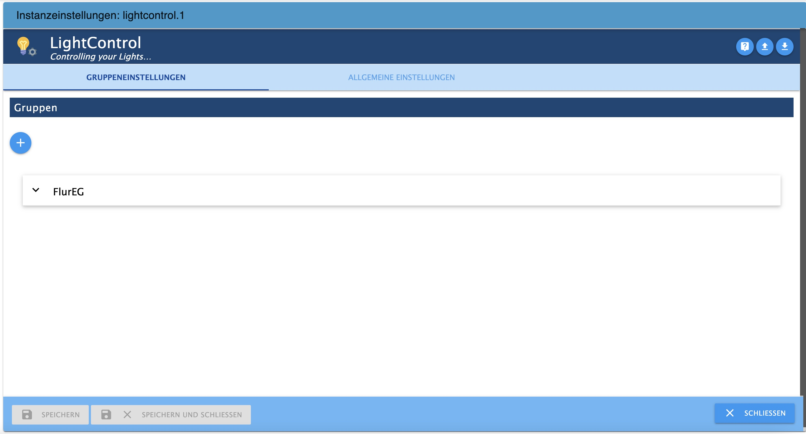
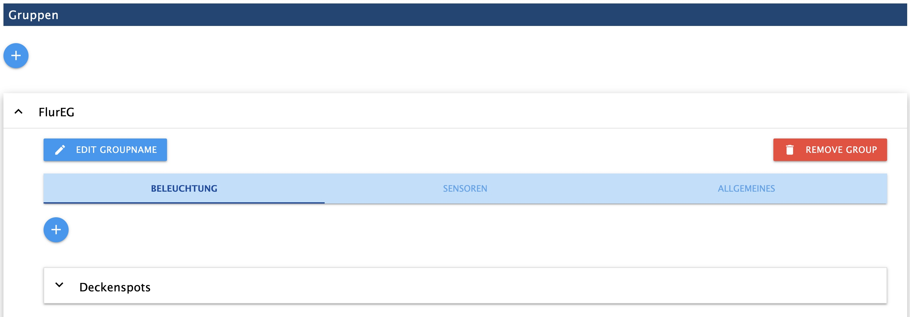
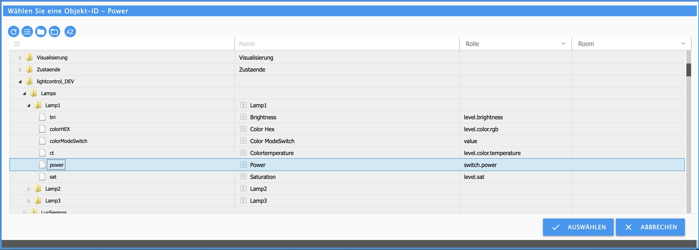
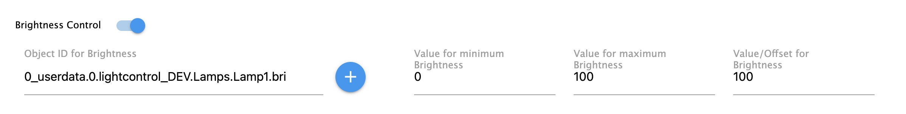
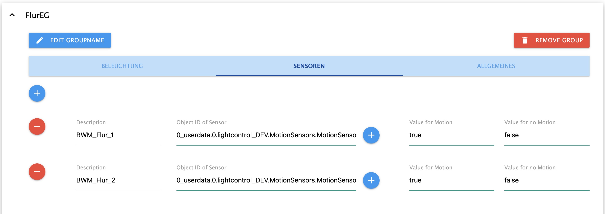
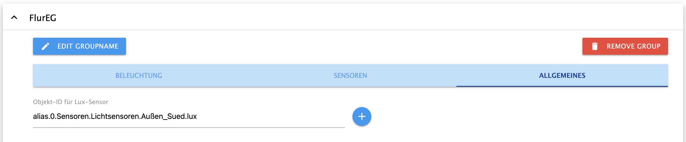

# LightControl
### *Controlling Lamps from different manufactures* 

!!! Englisch Version in development !!!

---

# Content 
* [1 Features](#1-features)
* [2 Installation](#2-installation)
* [3 Konfiguration](#3-konfiguration)
* [4 Gruppeneinstellungen - Startseite](#4-gruppeneinstellungen) 
  * [4.1 Beleuchtung](#41-beleuchtung)
    * [4.1.1 Allgemeines](#411-allgemeines)
    * [4.1.2 Lampe hinzufügen und entfernen](#412-lampe-hinzufügen-und-entfernen)
    * [4.1.3 Objekt IDs und Werte](#413-objekt-ids-und-werte)
  * [4.2 Sensoren](#42-sensoren)
    * [4.2.1 Allgemeines](#421-allgemeines)
    * [4.2.2 Sensor hinzufügen und entfernen](#422-sensor-hinzufügen-und-entfernen)
    * [4.2.3 Objekt IDs und Werte](#423-objekt-ids-und-werte)
  * [4.3 Allgemeines](#)
* [5 Allgemeine Einstellungen](#5-allgemeine-einstellungen)
* [6 Datenpunkte](#7-datenpunkte)
  * [6.1 Datenpunkte für alle Gruppen](#61-datenpunkte-für-alle-gruppen)
  * [6.2 Datenpunkte der einzelnen Gruppe](#62-datenpunkte-der-einzelnen-gruppe)
* [7 Was ist für die Zukunft geplant](#6-was-ist-fr-die-zukunft-geplant) 
* [8 Was ist nicht geplant](#8-was-ist-nicht-geplant)

---

# 1. Features

* Gruppierung beliebig vieler Lampen/Leuchtmittel
* Verwendung gemischter Lampen/Farbsystemen und Umrechnung der Farbsysteme (Hex,Rgb,Xy)
* Möglichkeit der Zuweisung von defaultwerten zu jedem Leuchtmittel (gleiche Helligkeit trotz unterschiedlich leistungsstarker Leuchtmittel)
* Verwendung beliebig vieler Bewegungsmelder pro Gruppe
* Ramping (langsame Änderung der Helligkeit bis Zielwert) für on und off
* Hoch- und Runterdimmen
* AutoOff nach Zeit / Kein Off bei Bewegung; 
* AutoOff nach Helligkeit
* AutoOn bei Bewegung ab bestimmter Helligkeit 
* AutoOn bei Dunkelheit
* AutoOn bei Anwesenheitszählererhöhung ab bestimmter Helligkeit (Begrüßungslicht bei heimkommen)
* Override on (Putzlicht)
* Masterswitch um alle Gruppen gemeinsam ein- und auszuschalten (Gleichzeitig Indikator, wenn alle Gruppen an sind)
* Info Datenpunkt für "beliebige Gruppe ist ein"
* Blinken (Alarm, Türklingel, etc.)
* Adaptive Helligkeit (Bei Aussenhelligkeit über 1000 Lux volle Helligkeit (100%), darunter linear dunkler bis 0 Lux (2%))
* Adaptive Farbtemperatur (4 dynamische Modi: Linear (linear ansteigend von Sonnenaufgang bis Sonnenmittag, dann linear abfallend bis Sonnenuntergang), Solar (entsprechend der Sonnenhöhe errechneter Sinus, maxCt ist Jahreszeitenabhängig), SolarInterpoliert (wie Solar, jedoch ohne Jahreszeitenabhängigkeit), StartYourDay (linear Absteigend von Start-Uhrzeit - Sonnenuntergang)   

---
* [zurück zum Inhaltsverzeichnis](#inhaltsverzeichnis)
---

# 2. Installation

Der Adapter befindet sich in der Testphase und ist noch nicht bei ioBroker released. 
Um ihn installieren zu können muss man zu den Adapter von ioBroker gehen und über die "Katze" (Experteneinstellung) "Benutzerdefiniert" anklicken. 
Dann den Github-Link: [https://github.com/Schmakus/ioBroker.lightcontrol.git](https://github.com/Schmakus/ioBroker.lightcontrol.git) einfügen.

Nach dem Download kann man durch anklicken des (+) eine Instanz angelgen.

---
* [zurück zum Inhaltsverzeichnis](#inhaltsverzeichnis)
---

# 3. Konfiguration

Sollte in dem Installationsfenster die Checkbox "***schließen, wenn fertig***" nicht angehakt sein muss man dieses natürlich noch schließen.

Das Konfigurationsfenster besteht aus den Reitern:
* [4. Gruppeneinstellungen](#4-gruppen-einstellungen)
* [5. Allgemeine Einstellungen](#5-allgemeine-einstellungen)

---
* [zurück zum Inhaltsverzeichnis](#inhaltsverzeichnis)
---

# 4. Gruppeneinstellungen

Das Konfigurationsfenster öffnet sich automatisch mit den Gruppeneinstellungen. Hier werden die einzelnen Lichtgruppen erstellt.

Mit Klick auf das + wird eine neue Gruppe erstellt. Erlaubtes Sonderzeichnen ist ausschließlich "_". 

Um eine Gruppe zu bearbeiten, klickt man auf den Gruppennamen. Es öffnet sich ein weiteres Menü.
Hier lassen sich die jeweiligen Lampen und Sensoren konfigurieren.

**Mit "EDIT GROUPNAME" lässt sicher Gruppenname ändern.**
**Mit "REMOVE GROUP" kann die Gruppe gelöscht werden.**

* [4.1 Beleuchtung](#41-beleuchtung)
* [4.2 Sensoren](#42-sensoren)
* [4.3 Allgemeines](#43-allgemeines)

---
* [zurück zum Inhaltsverzeichnis](#inhaltsverzeichnis)
---

## 4.1 Beleuchtung
### 4.1.1 Allgemeines

Info: Eine Objekt-ID lässt sich durch Klick auf das + neben dem Eingabefeld auswählen oder kann direkt eingegeben werden.
Dabei bitte die Datenpunkte mit STATE (o. ä.) auswählen. NICHT das Gerät als solches.

### 4.1.2 Lampe hinzufügen und entfernen

Um eine neue Lamoe hinzuzufügen, muss man auf das + klicken. Es öffnet sich ein Fenster um den Namen der Lampe festzulegen.
Um eine Lampe zu entfernen, öffnet man die Konfiguration der Lampe und klickt auf den rechten roten Button "Remove Light".

### 4.1.3 Objekt-IDs und Werte

* **Power On/Off => Plichtfeld**
    * Object-ID for Power On/Off – *Die Objekt ID des Ein/Aus states der Lampe*
    * Value for On - *Wert für Ein. z.B. true*
    * Value for Off - *Wert für Aus. z.B. false*

  
---
* **Brightness Control => Aktivieren über den Switch**
    * Object-ID for Brighness – *Die Objekt ID für die Helligkeit der Lampe*
    * Value for minimum Brightness - *Wert die geringste Helligkeit. z.B. 0*
    * Value for maximum Brightnes - *Wert für die maximalste Helligkeit. z.B. 100*
    * Value/Offset for Brightness - *Wert für die Anpassung der Helligkeit gegenüber den anderen Lampen innerhalb der Gruppe. 100 = keine Anpassung // 50 = Halb so hell*

  
---
* **Color-Temperature Control => Aktivieren über den Switch**
    * Object-ID for Color-Temperature – *Die Objekt ID für die Farbtemperatur der Lampe*
    * Value for minimum Color-Temperature - *Wert Warmweiß. z.B. 250*
    * Value for maximum Color-Temperature - *Wert für Kaltweiß. z.B. 452*

  
---
* **Saturation Control => Aktivieren über den Switch**
    * Object-ID for Saturation – *Die Objekt ID für die Sättigung der Lampe*
    * Value for minimum Saturation - *Wert für die geringste Sättigung. z.B. 0*
    * Value for maximum Saturation - *Wert für die maximale Sättigung. z.B. 100*

  
---
* **ModeSwitch Control => Aktivieren über den Switch**
    * Object-ID for ModeSwitch – *Die Objekt ID für die Modusänderung (Farbe/Sättigung) Lampe*
    * Value for White Mode - *Wert für den Weiß-Modus. z.B. false*
    * Value for Color Mode - *Wert für den Farbmodus. z.B. true*

  
---
* **Color Control => Aktivieren über den Switch**
    * Object-ID for Color – *Die Objekt ID für Farbe Lampe*
    * Color Type - *Typ der Farbvorgabe (HEX => #FFFFFF // RGB => 255,255,255 // XY => [0.4992,0.418])*
    * Default Value for Color- *Standardwert. z.B. #FFFFFF*

  

---
* [zurück zum Inhaltsverzeichnis](#inhaltsverzeichnis)
---

## 4.2 Sensoren
### 4.2.1 Allgemeines

Hier werden i.d.R. Bewegungsmelder, Präsenzmelder, Lichtschranken oder Ähnlich angegeben.
Es können beliebig viele Sensoren hinzugefügt werden.
Es gilt:
    * Wenn ein Sensor auslöst, wird das Licht geschalten (sofern in den Datenpunkten aktiviert).
    * Erst wenn ALLE Sensoren nichts mehr registrieren, wird der Ausschaltprozess gestartet (sofern in den Datenpunkten aktiviert).

> Hinweis: Theoretisch können hier auch Schalter angegeben werden. Hauptsache es gibt für Ein/Aus unterschiedliche Werte. Jedoch verhält sich der Auschaltprozess je nach Einstellung. z.B. Licht geht aus nach 60 Sekunden

Info: Eine Objekt-ID lässt sich durch Klick auf das + neben dem Eingabefeld auswählen oder kann direkt eingegeben werden.
Dabei bitte die Datenpunkte mit STATE (o. ä.) auswählen. NICHT das Gerät als solches.

### 4.2.2 Sensor hinzufügen und entfernen

Um einen neuen Sensor hinzuzufügen, muss man auf das + klicken. Es öffnet sich ein Fenster um den Namen des Sensors festzulegen.
Um einen Sensor zu entfernen klickt man auf den roten Button mit dem -.

### 4.2.3 Objekt-IDs und Werte

* Description – *Bezeichnung des Sensors*
* Object-ID of Sensor - *Objekt-ID des Sensors, welche für die Bewegung/Auslösung zuständig ist* 
* Value for Motion - *Wert für Bewegung erkannt. z.B. true*
* Value for noMotion - *Wert für keine Bewegung. z.B. false*

---
* [zurück zum Inhaltsverzeichnis](#inhaltsverzeichnis)
---

## 4.3 Allgemeines

Hier kann ein individueller Lichtsensor definiert werden.
Im Standard wird der globale Lichtsensor verwendet

Info: Eine Objekt-ID lässt sich durch Klick auf das + neben dem Eingabefeld auswählen oder kann direkt eingegeben werden.
Dabei bitte die Datenpunkte mit STATE (o. ä.) auswählen. NICHT das Gerät als solches.

---
* [zurück zum Inhaltsverzeichnis](#inhaltsverzeichnis)
---

# 5 Allgemeine Einstellungen

> Zum Öffnen der jeweiligen Einstellung muss auf diese geklickt werden.

* **Einstellungen für globalen Lux-Sensor**
  * Dieser Sensor wird global verwendet, sofern nicht innerhalb einer Gruppe ein individueller Sensor gewählt wurde
  * Object-ID of Sensor - *Objekt-ID des Sensors, welche für die Helligkeit zuständig ist* 
* **Einstellungen für die Farbtemperatur**
  * Minimalwert für die Farbtemperatur in Kelvin => Standard: 2700
  * Maximalwert für die Farbtemperatur in Kelvin => Standard: 6500
* **Einstellungen zum Dimmen**
  * Rampenschritte zum Dimmen => Standard: 10
  * Mindeshelligkeit beim Dimmen über den Datenpunkt *DimmDown* => Standard: 10
* **Einstellungen für Anwesenheit**
  * Objekt-ID der Anwesenheit => Muss *true* oder *false* sein
  * Objekt-ID des Anwesenheitszählers => Muss eine Nummer sein.

---
* [zurück zum Inhaltsverzeichnis](#inhaltsverzeichnis)
---

# 6 Datenpunkte
## 6.1 Datenpunkte für alle Gruppen

* **All**
  * **power:** Alle Gruppen ein-/ausschalten / Indikator, wenn alle Gruppen an sind
  * **anyOn:** *true* wenn mindestens eine Gruppe an ist

## 6.2 Datenpunkte der einzelnen Gruppe

* **Gruppe**
  * **autoOffLux:** AutoOff des Lichts bei erreichen einer Helligkeitsschwelle
	* **enabled:** AutoOff bei Helligkeit aktivieren/deaktivieren
	* **minLux:** minimaler Lichtwert
	* **dailyLock:** Bei false wird AutoOffTimed nicht ausgeführt
	* **operator:** Vergleich ob Licht über oder unter *minLux* ausgehen soll (z.B. > / < / >= / <=)

  * **autoOffTimed:** AutoOff nach fest eingestellter Zeit (Nur in Verbindung mit den Sensoren)
	* **enabled:** AutoOff aktivieren/deaktivieren
	* **autoOffTime:** Zeit bis AutoOff in Sekunden
	* **noAutoOffWhenMotion:** AutoOff resetten bei erneuter Bewegung
	* **noticeEnabled:** Hinweis für AutoOff aktivieren/deaktivieren (Aktuell noch ohne Funktion)
	* **noticeBri:** Helligkeit in Prozent bevor AutoOff
	* **noticeTime:** Zeit in Sekunden wann der Hinweis aktiviert wird bevor AutoOff

  * **autoOnLux:** Automatisch Licht ein bei Lux
	* **enabled:** Aktivieren/Deaktivieren
	* **minLux:** Lux-Schwellwert für das Schalten
	* **bri:** Helligkeit, mit der das Licht an geht
	* **color:** Farbe, mit das Licht an geht
	* **switchOnlyWhenPresence:** Nur Schalten, wenn jemand zuhause ist
	* **switchOnlyWhenNoPresence:** Nur schalten, wenn niemand zu hause ist
	* **dailyLock:** Bei false wird AutoOnLux nicht ausgeführt
	* **operator:** Vergleich ob Licht über oder unter *minLux* ausgehen soll (z.B. > / < / >= / <=)

  * **autoOnMotion:** Automatisch Licht ein bei Bewegung
	* **enabled:** Aktivieren/Deaktivieren
	* **minLux:** Lux-Schwellwert für das Schalten
	* **bri:** Helligkeit, mit der das Licht an geht
	* **color:** Farbe, mit das Licht an geht

  * **autoOnPresenceIncrease:** Automatisch Licht ein, wenn sich der Wert des Anwesenheitszähler größe als der letztere war
	* **enabled:** Aktivieren/Deaktivieren
	* **minLux:** Lux-Schwellwert für das Schalten
	* **bri:** Helligkeit, mit der das Licht an geht
	* **color:** Farbe, mit das Licht an geht

  * **blink:** Blinken lassen
	* **enabled:** Blinken lassen 
	* **frequency:** Blinkfrequenz in Sekunden
	* **blinks:** Anzahl der Blinker
	* **bri:** Helligkeit der Lampen beim Blinken
	* **color:** Farbe der Lampen beim Blinken

  * **rampOff:** Runterdimmen beim Ausschalten
	* **enabled:** Aktivieren/Deaktivieren
	* **time:** Zeit für das Runterdimmen (sollte nicht kleiner als 10 Sekunden sein)
	* **switchOutletsLast:** Lampen welche nur ein-/ausgeschaltet werden zuletzt aktivieren?

  * **rampOn:** Hochdimmen beim Einschalten
	* **enabled:** Aktivieren/Deaktivieren
	* **time:** Zeit für das Hochdimmen (sollte nicht kleiner als 10 Sekunden sein)
	* **switchOutletsLast:** Lampen welche nur ein-/ausgeschaltet werden zuletzt aktivieren?

  *	**adaptiveBri:** Adaptive Helligkeit ein-/ausschalten
  *	**adaptiveCt:** Adaptive Farbtemperatur ein-/ausschalten
  * **adaptiveCtMode:** Modus der adaptiven Farbtemperatur
    * **Linear** (Sonnenaufgang --> Mittag --> Sonnenuntergang)
    * **Solar**  (entsprechend der Sonnenhöhe errechneter Sinus, maxCt ist Jahreszeitenabhängig)
    * **SolarInterpoliert** (wie Solar, jedoch ohne Jahreszeitenabhängigkeit)
    * **StartYourDay** (linear Absteigend von Start-Uhrzeit - Sonnenuntergang)
  * **adaptiveCtTime:** Startzeit Adaptive Farbtemperature bei Modus: StartYourDay
  * **bri:** Helligkeit setzen (0-100%)
  *	**color:** Farbe setzen als Hex-Wert (#FFFFFF)
  * **ct:** Farbtemeratur setzen in Kelvin
  * **dimmAmount:** Schritte zum Dimmen in %
  * **dimmDown:** Button Runterdimmen
  * **dimmUp:** Button Hochdimmen
  * **isMotion:** Aktivieren/Deaktivieren der Sensoren
  * **power:** Ein-/Ausschalten
  * **powerCleaningLight:** Putzlicht (setzt Helligkeit auf 100% und Farbtemperatur auf Kaltweiß)

---
* [zurück zum Inhaltsverzeichnis](#inhaltsverzeichnis)
---

# 7 Was ist für die Zukunft geplant

- [ ] CodeCleaning.... ;-)
- [ ] Hinweisfunktion bei AutoOff mit reduzierter Helligkeit
- [ ] Intergration von einfachen Button-Events (Ein/Aus/Dimmen) für jede Gruppe
- [ ] Vereinfachung der Konfiguration der Objekt-IDs

---
* [zurück zum Inhaltsverzeichnis](#inhaltsverzeichnis)
---

# 8 Was ist nicht geplant
- [x] Zeitpläne für das Aktivieren oder Deaktivieren von Funktionen oder zum setzten von verschiedenen Helligkeiten, etc. sind definitiv nicht geplant!!
