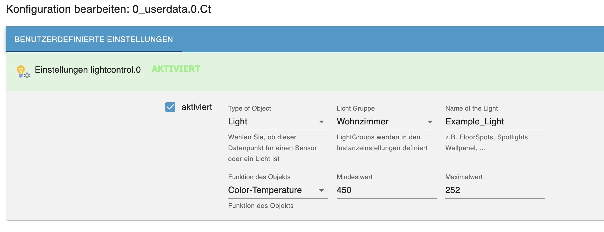

# LightControl

### _Light control of lamps from various manufacturers_

---

# table of contents

-   [1 Features](#1-features)
-   [2 Installation](#2-installation)
-   [3 Configuration](#3-konfiguration)
-   [4 Group Settings](#4-gruppeneinstellungen)
    -   [4.1 Light groups](#41-lichtgruppen)
    -   [4.2 General Settings](#42-allgemeine-einstellungen)
-   [5 Lights and Sensors](#5-lichter-und-sensoren)
    -   [5.1 Lights](#51-lichter)
    -   [5.2 Sensors](#52-sensoren)
-   [6 Datapoints](#7-datenpunkte)
    -   [6.1 Datapoints for all groups](#61-datenpunkte-für-alle-gruppen)
    -   [6.2 Datapoints for each group](#62-datenpunkte-der-einzelnen-gruppe)
-   [7 What is planned for future](#6-was-ist-fr-die-zukunft-geplant)
-   [8 What is not planned](#8-was-ist-nicht-geplant)

---

# 1. Features

-   Grouping of any number of lamps/bulbs
-   Use of mixed lamps/colour systems and conversion of colour systems (hex, rgb, xy)
-   Possibility to assign default values to each illuminant (same brightness despite differently powerful illuminant)
-   Use any number of motion sensors per group
-   Ramping (slow change of brightness to target value) for on and off
-   Dimming up and down
-   AutoOff by time / No off if motion;
-   AutoOff by brightness
-   AutoOn when moving from certain brightness
-   AutoOn in the dark
-   AutoOn at presence counter increase from certain brightness (welcome light when coming home)
-   Override on (cleaning light)
-   Masterswitch to switch all groups on and off together (Simultaneously indicator when all groups are on)
-   Info Data point for "any group is a"
-   flashing (alarm, doorbell, etc.)
-   Adaptive brightness (At outdoor brightness above 1000 lux full brightness (100%), including linearly darker to 0 lux (2%))
-   Adaptive color temperature (4 dynamic modes: Linear (linearly rising from sunrise to noon, then linearly falling to sunset), Solar (according to the sun height calculated sine, maxCt is seasonal), SolarInterpolished (like solar, but without seasonal dependency), StartYourDay (linear descending from start-time - sunset) 

---

-   [back to table of contents](#inhaltsverzeichnis)

---

# 2. Installation

The adapter is in the test phase and is not yet released by ioBroker.
To install you have to go to the ioBroker adapter tab and click on the "Cat" (expert setting) "Custom".
Then add the Github link: [https://github.com/Schmakus/ioBroker.lightcontrol.git](https://github.com/Schmakus/ioBroker.lightcontrol.git).

After the download you can click on the (+) an instance.

---

-   [back to table of contents](#inhaltsverzeichnis)

---

# 3. Configuration

If the checkbox "**_should close in the installation window, if finished_**" is not checked you have to close it.

The configuration window consists of the tabs:

-   [4. Group settings](#4-gruppen-einstellungen)
-   [5. Lights and Sensors](#5-lichter-und-sensoren)

---

-   [back to table of contents](#inhaltsverzeichnis)

---

# 4. Group Settings

The configuration window opens automatically with the group settings, where the individual light groups are created.

## 4.1 Light Groups

Clicking on the + will create a new line.

-   Description: Here you name the group. Attention: Do not create dublicates!!
-   Individual lux sensor: Here you define an individual lux sensor. An object ID can be inserted via the 3 dots on the right side. If the field is left empty, the global lux sensor is used for the light group, if one is defined.

## 4.2 General Settings

-   **Global lux sensor settings**
    -   This sensor is used globally unless an individual sensor has been selected within a group
    -   A numeric data point must be selected!
-   **Color temperature settings**
    -   Minimum value for color temperature in Kelvin => standard: 2700
    -   Maximum color temperature in Kelvin => Standard: 6500
-   **Dimming settings**
    -   Ramp steps for dimming => Default: 10
    -   Minimum brightness when dimming via the data point _DimmDown_ => Default: 10
-   **Presence settings**
    -   Object ID of presence => Must be _true_ or _false_
    -   Object ID of the attendance counter => Must be a number.
-   **Logging**
    -   Advanced user logging

---

-   [back to table of contents](#inhaltsverzeichnis)

---

# 5 Lights and Sensors

All lights and sensors are added to the light groups via the respective data points:

After opening the settings, the configuration must be activated:

## 5.1 Lights

-   **Type of object**
    In many cases, LightControl detects whether it is a light or sensor, if not, then \_Licht_is preset.

-   **Light group**
    Here you select the previously defined light groups in the instance settings (multiple selection possible -> bug)

-   **Light name**
    Define a name for the light Previously defined names are suggested for selection

-   **Function of object**
    In many cases, LightControl detects which function it could be. If the automatic detection does not correspond to what is desired, then select the respective function via the DropDown menu

    

    -   **Switch**

        -   Power On Value - _value for exampletrue_
        -   Power Off Value - _value for examplefalse_

    -   **Brightness**

        -   Value for minimum brightness - _value the lowest brightness.eg0_
        -   Value for maximum Brightnes - _value for maximum brightness.eg100_
        -   Value/Offset for Brightness - _value in percent for adjusting the brightness against the other lamps within the group. 100 = no adjustment // 50 = half as hell_
        -   Use brightness to switch the lamp (still without function)

    -   **Color-Temperature**

        -   Value for minimum Color-Temperature - _Value warm white.eg250_
        -   Value for maximum Color-Temperature - _value for cold white, for example452_
        -   Send color temperature directly to lamp (still without function)

    -   **Saturation**

        -   Value for minimum saturation - _value for the lowest saturation.eg0_
        -   Value for maximum saturation - _value for maximum saturation.eg100_
        -   Send saturation directly to lamp (still without function)

    -   **ModeSwitch**

        -   Value for White Mode - _Value for White Mode, e.g., false_
        -   Value for Color Mode - _value for the color mode, e.g., true_

    -   **Color**
        -   Color Type - _Type of color specification (HEX => #FFFFFF // RGB => 255,255 // XY => [0.4992,0.418])_
        -   Default Value for Color- _Default value, e.g., #FFFFFF_
        -   Send color directly to lamp (still without function)

-   [back to table of contents](#inhaltsverzeichnis)

---

## 5.2 Sensors

### 4.2.1 General

-   When a sensor triggers, the light is switched (if activated in the data points).
-   Only when ALL sensors no longer register, the switch-off process is started (if activated in the data points).

> Note: Theoretically, switches can also be specified here, as long as there are different values for on/off. However, the shutdown process depends on the setting, for example, light goes off after 60 seconds

-   Value for Motion - _Value for motion detected; e.g., true_
-   Value for noMotion - _Value for no movement, e.g., false_

---

-   [back to table of contents](#inhaltsverzeichnis)

# 6 Datapoints

## 6.1 Datapoints for all Groups

-   **All**
    -   **power:** All groups on/off / indicator when all groups are on
    -   **anyOn:** _true_ if at least one group is on

## 6.2 Datapoints for each group

-   **Group**

    -   **autoOffLux:** AutoOff of light reaching a brightness threshold

        -   **enabled:** Enable/disable AutoOff at brightness
        -   **minLux:** minimum light value
        -   **dailyLock:** AutoOffTimed not running if false
        -   **operator:** Compare if light should go above or below _minLux_ (e.g., > / < / >= / <=)

    -   **autoOffTimed:** AutoOff after fixed time (only in connection with the sensors)

        -   **enabled:** Enable/Disable AutoOff
        -   **autoOffTime:** Time to AutoOff in seconds
        -   \*noAutoOffWhenMotion:\*\* AutoOff reset when moving again
        -   **noticeEnabled:** Enable/Disable Hint for AutoOff (Currently Not Working)
        -   **noticeBri:** Brightness in percent before AutoOff
        -   **noticeTime:** Time in seconds before AutoOff

    -   **autoOnLux:** Automatically light on at Lux

        -   **enabled:** Enable/Disable
        -   **minLux:** Lux threshold for switching
        -   **bri:** Brightness with which the light turns on
        -   **color:** color with which light goes on
        -   **switchOnlyWhenPresence:** Only switch when someone is at home
        -   **switchOnlyWhenNoPresence:** Only switch when no one is at home
        -   **dailyLock:** AutoOnLux does not run if false
        -   **operator:** Compare if light should go above or below _minLux_ (e.g., > / < / >= / <=)

    -   **autoOnMotion:** Automatically light on when moving

        -   **enabled:** Enable/Disable
        -   **minLux:** Lux threshold for switching
        -   **bri:** Brightness with which the light turns on
        -   **color:** color with which light goes on

    -   **autoOnPresenceIncrease:** Automatically light on when the value of the attendance counter was larger than the latter

        -   **enabled:** Enable/Disable
        -   **minLux:** Lux threshold for switching
        -   **bri:** Brightness with which the light turns on
        -   **color:** color with which light goes on

    -   **blink:** blink

        -   **enabled:** Starts flashing in infinite loop, => stops flashing
        -   **start:** Starts flashing until number reached.
        -   **frequency:** flashing frequency in seconds
        -   **blinks:** Number of indicators
        -   **bri:** Brightness of the lamps when flashing
        -   **color:** Color of the lamps when flashing

    -   **rampOff:** Dimming when power off

        -   **enabled:** Enable/Disable
        -   **time:** Dimming time (should not be less than 10 seconds)
        -   **switchOutletsLast:** Lights that are only turned on/off last?

    -   **rampOn:** High tuning when switching on

        -   **enabled:** Enable/Disable
        -   **time:** time for high pitching (should not be less than 10 seconds)
        -   **switchOutletsLast:** Lights that are only turned on/off last?

    -   **adaptiveBri:** Adaptive brightness on/off
    -   **adaptiveCt:** Adaptive color temperature on/off
    -   \*adaptive mode:\*\* adaptive color temperature mode
        -   **Linear** (sunrise -> noon -> sunset)
        -   **Solar** (according to the sun height of calculated sine, maxCt is seasonal)
        -   **SolarInterpolished** (like solar, but without seasonal dependency)
        -   **StartYourDay** (linear descending from start time - sunset)
    -   **adaptiveCtTime:** Start time Adaptive color temperatures at mode: StartYourDay
    -   **bri:** Set brightness (0-100%)
    -   **color:** Set color as hex value (#FFFFFF)
    -   **ct:** Set color value in Kelvin
    -   **dimmAmount:** Steps to dim in %
    -   **dimmDown:** Button Dimming
    -   **dimmUp:** Button Treble
    -   \*isMotion:\*\* Enable/Disable Sensors
    -   **power:** Power on/off
    -   **powerCleaningLight:** cleaning light (sets brightness to 100% and color temperature to cool white)

---

-   [back to table of contents](#inhaltsverzeichnis)

---

# 7 What is planned for the future

-   [ ] CodeCleaning...;-)
-   [ ] Hint function for AutoOff with reduced brightness
-   [ ] Integration of simple button events (on/off/dimming) for each group

---

-   [back to table of contents](#inhaltsverzeichnis)

---

# 8 What is not planned

-   [x] Schedules for enabling or disabling functions or setting different brightness levels, etc.
